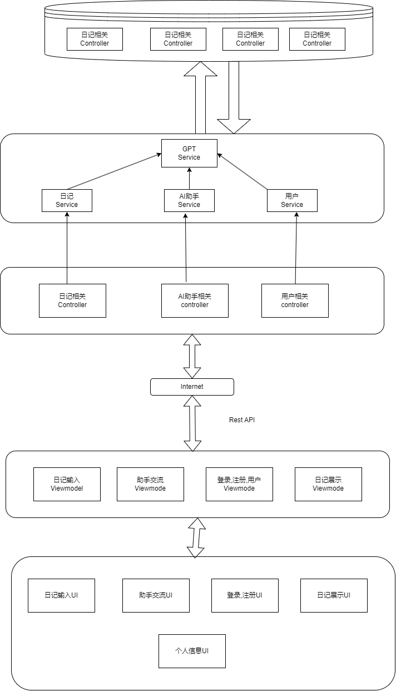

# 体系结构设计

### 整体逻辑视图

## 前端:

客户端逻辑视角（安卓端 - MVI架构）

### 职责

1. **界面层 (User Interface - Android - View):**
   - **用户交互：** 提供用户友好的界面，以支持文字、语音、和图片输入，以及浏览、编辑、删除日记的功能。
   - **数据显示：** 展示用户的日记内容，包括文字、图片、位置信息等。
   - **图形化时间轴：** 提供可视化的时间轴，方便用户按日期和时间查看过去的日记。
   - **聊天界面：** 集成ChatGPT，提供与虚拟助手的聊天界面，以及与用户进行对话的功能。
   - **用户设置：** 提供设置界面，让用户配置提醒、隐私设置、通知偏好等。
2. **Intent层 (AndroidController - MVI Intent):**
   - **用户输入处理：** 处理用户通过界面层输入的各种指令，如创建新日记、上传图片、设置提醒等。
   - **业务逻辑：** 包括但不限于图片识别、语音转文字、ChatGPT交互的业务逻辑处理。
3. **Model层 (AndroidDatabase - Model):**
   - **数据模型定义：** 定义日记的数据结构，包括标题、内容、时间、图片描述、情感状态等。
   - **数据交互：** 发送和接受请求和后端进行交互
   - **图像识别和语音处理：** 集成图像识别引擎和语音转文字引擎，处理用户上传的图片和语音输入。
   - **位置信息管理：** 存储和检索用户的位置信息，与日记内容关联。

## 后端:

#### 后端逻辑视角（Spring Boot MVC架构）

- **控制层 (Controller):**
  - **用户请求处理：** 处理来自前端的HTTP请求，包括创建、编辑、查看日记等操作。
  - **业务逻辑协调：** 调用服务层的方法协调业务逻辑，确保请求得到正确的处理。
  - **数据转发：** 将请求中的数据传递给服务层，将服务层返回的数据传递给前端。
- **服务层 (Service):**
  - **业务逻辑处理：** 包含业务逻辑，例如处理用户输入、图像识别、情感分析等。
  - **调用数据访问层：** 调用数据访问层的方法执行对数据库的 CRUD 操作。
  - **事务管理：** 管理业务逻辑的事务，确保数据的一致性。
- **数据访问层 (Repository):**
  - **定义数据模型：** 定义日记的数据结构，即数据库表对应的实体类。
  - **提供对数据库的操作：** 提供对数据库的 CRUD 操作的方法。
  - **处理数据库交互的细节：** 处理与数据库交互的细节，如事务管理和异常处理。

## 信息视角

### 数据持久化对象

### UserEntity

| 属性      | 定义         | 类型   |
| --------- | ------------ | ------ |
| id        | 用户编号     | Long   |
| username  | 用户名       | String |
| password  | 密码         | String |
| email     | 电子邮件     | String |
| createdAt | 创建时间     | Date   |
| updatedAt | 最后更新时间 | Date   |

### MessageEntity

| 属性      | 定义         | 类型    |
| --------- | ------------ | ------- |
| id        | 消息编号     | Long    |
| content   | 消息内容     | String  |
| timestamp | 时间戳       | Date    |
| isUserMe  | 是否用户发出 | Boolean |
| authorId  | 作者编号     | Long    |
| createdAt | 创建时间     | Date    |
| updatedAt | 最后更新时间 | Date    |

### GPTApiEntity

| 属性      | 定义         | 类型    |
| --------- | ------------ | ------- |
| id        | API编号      | Long    |
| type      | API类型      | APiType |
| apiKey    | API密钥      | String  |
| createdAt | 创建时间     | Date    |
| updatedAt | 最后更新时间 | Date    |

### DiaryEntity

| 属性      | 定义         | 类型   |
| --------- | ------------ | ------ |
| id        | 日记编号     | Long   |
| title     | 标题         | String |
| content   | 内容         | String |
| timestamp | 时间戳       | Date   |
| position  | 位置         | String |
| type      | 类型         | String |
| authorId  | 作者编号     | Long   |
| createdAt | 创建时间     | Date   |
| updatedAt | 最后更新时间 |        |

### DAO层方法

### serDAO

| 方法签名                                               | 描述                 |
| ------------------------------------------------------ | -------------------- |
| `Optional<UserEntity> findById(Long id)`               | 根据用户编号查询用户 |
| `Optional<UserEntity> findByUsername(String username)` | 根据用户名查询用户   |
| `Optional<UserEntity> findByEmail(String email)`       | 根据电子邮件查询用户 |
| `List<UserEntity> findAll()`                           | 获取所有用户         |
| `UserEntity save(UserEntity user)`                     | 保存用户             |
| `void deleteById(Long id)`                             | 根据用户编号删除用户 |

### MessageDAO

| 方法签名                                                     | 描述                             |
| ------------------------------------------------------------ | -------------------------------- |
| `Optional<MessageEntity> findById(Long id)`                  | 根据消息编号查询消息             |
| `List<MessageEntity> findAllByAuthorId(Long authorId)`       | 根据作者编号查询所有消息         |
| `List<MessageEntity> findAllByAuthorIdAndTimestampAfter(Long authorId, Date timestamp)` | 根据作者编号和时间戳查询所有消息 |
| `MessageEntity save(MessageEntity message)`                  | 保存消息                         |
| `void deleteById(Long id)`                                   | 根据消息编号删除消息             |

### GPTApiDAO

| 方法签名                                          | 描述               |
| ------------------------------------------------- | ------------------ |
| `Optional<GPTApiEntity> findById(Long id)`        | 根据API编号查询API |
| `Optional<GPTApiEntity> findByType(APiType type)` | 根据API类型查询API |
| `GPTApiEntity save(GPTApiEntity api)`             | 保存API            |
| `void deleteById(Long id)`                        | 根据API编号删除API |

### DiaryDAO

| 方法签名                                                     | 描述                     |
| ------------------------------------------------------------ | ------------------------ |
| `Optional<DiaryEntity> findById(Long id)`                    | 根据日记编号查询日记     |
| `List<DiaryEntity> findAllByAuthorId(Long authorId)`         | 根据作者编号查询所有日记 |
| `List<DiaryEntity> findAllByTimestampBetween(Date start, Date end)` | 根据时间范围查询所有日记 |
| `DiaryEntity save(DiaryEntity diary)`                        | 保存日记                 |
| `void deleteById(Long id)`                                   | 根据日记编号删除日记     |

## 第三方服务:

1. **语音转文本服务:** 集成第三方语音转文本服务，以支持语音输入的文本转化。
2. **图像识别服务:** 集成第三方图像识别服务，以实现对用户上传图片的内容分析。
3. **ChatGPT服务:** 使用ChatGPT的API服务，支持应用与用户的自然语言对话。

## 安全性:

1. **用户身份验证:** 确保用户身份的安全，采用合适的身份验证手段
2. **数据加密:** 对用户的敏感信息进行加密存储，确保数据的安全性。
3. **访问控制:** 设计访问控制策略，限制对敏感数据的访问权限，保护用户隐私。
4. **日志记录:** 记录系统操作日志，以便追溯和分析潜在的安全问题。