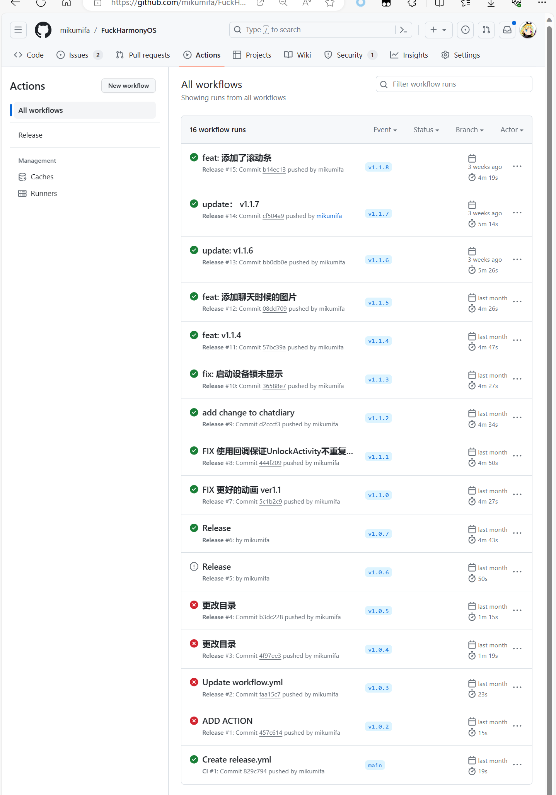

## 移动互联网评分量表

### 1. 项目创新性和原创性（20分）

- **独特性（5分）：** 项目是否具有独特的特色，与已有的移动应用有何不同之处？
  - 我们再日记上加入了大语言模型
  - 在日记上加入了情感分析
  - 通过图片识别来分析图片
  - 增加了对日记情感信息的统计
  - 添加了对系统主题的适配（深色主题）
  - 支持多语言切换
  - 支持多主题切换
  - 交互添加了大量的动画来平滑操作
- **创新技术（5分）：** 是否使用了高级特性或者其他新颖的技术，展现了对技术的深刻理解？
  - 部分场景界面使用了Android推崇的MVI架构，在Android开发中较为高级和新颖的Jetpack Compose及其一系列产品
  - 对于网络请求，用户配置等读取，使用了Android推出的Flow流
  - 使用了Hilt注入框架来管理类的注入，实现了解构，同时是的代码框架更加简洁
  - 使用了Coil 图像加载库，考虑到Coil的性能上优势，我们放弃了Android自带的图片加载、
  - 使用了Lottie矢量动画，考虑到了Lottie多种动画效果以及强大的社区支持
  - redis缓存
  - 数据库索引
  - Material 3主题， M3作为很新的主题， 我们更好的利用他的优势，添加了多种颜色主题，可以自由切换
  - retrofit2网路请求库，为了提高合适的性能，我们选择了用户评价较好的retrofit2，同时使用Coil注入
  - Android Security， 我们再安全方面做了很多，我们添加了多重身份的认证（BiometricOrCredentialAuthentication），在缓存用户数据时候也进行了加密处理（[EncryptedSharedPreferences](https://developer.android.com/reference/androidx/security/crypto/EncryptedSharedPreferences)），

- **用户体验创新（5分）：** 项目在用户界面和用户体验上是否有独到之处，提供了更好的用户交互体验？
  - Material 3主题，颜色切换
  - i8n 国际化
  - 沉浸式边框，适配全面屏手机
  - Lottie矢量动画
  - 简洁的设计风格
  - 日记锁功能，保护安全

- **问题解决方案（5分）：** 项目是否解决了实际问题，对用户或者某个领域带来了便利或者改进？
  - 日记方面提供了便利，进行了小范围传播， 并且用户反响很好，我们的服务以及启用达到4周，目前有11位用户，66篇日记
  - 用户能够更好的记录每天的生活
  - 同时我们提供了GPT-3.5的模型，可以供用户日常使用，目前交互记录已达到77条

### 2. 技术实现和性能（30分）

- **代码质量（10分）：** 代码是否规范、清晰，是否有适当的注释和文档？
  - 代码结构清晰
    - android部分，严格使用viewModel与view进行交互，结构清晰， 对界面按照路径镜像分包，更加清晰
    - 后端部分，严格按照springboot的MVC架构
  - 变量和函数命名规范
    - 符合规范
  - 异常处理
    - android部分，我们使用Flow来更好的处理异常
    - 后端部分， 我们对每一个可能的错误进行统一的处理
    - 前后端连续运行4周，未出现验证的错误
- **功能完整性（10分）：** 是否实现了规定的功能，功能是否完整，是否有未解决的 bug？
  - 功能是否满足需求
- **性能优化（5分）：** 项目是否对性能进行了优化，如响应速度、资源利用等？
  -  响应速度
     -  选用Jetpack Compose，其自身有很快的反应速度
     -  Coil 图像加载库提高了图片加载的速度
     -  retrofit2网路请求库 提高了网络速度
     -  并发处理，网络请求使用协程来调用
     -  对于用户本地缓存，使用了
     -  redis缓存
  -  内存占用
     -  Hilt管理viewModel，这有效降低了内存泄漏的风险
     -  巧妙使用了Kotlin 流支持背压（backpressure）处理，这意味着可以有效地处理生产速度和消费速度不匹配的情况，以避免内存泄漏或崩溃。
  -  数据传输效率
     -  retrofit2网路请求库 提高了网络速度
     -  Flow高效的速度（反应式编程）
- **安全性（5分）：** 项目是否考虑了安全性，防范了潜在的安全风险？
  - 数据加密与隐私保护
    - 我们再安全方面做了很多，我们添加了多重身份的认证（BiometricOrCredentialAuthentication），在缓存用户数据时候也进行了加密处理（[EncryptedSharedPreferences](https://developer.android.com/reference/androidx/security/crypto/EncryptedSharedPreferences)）
    - 使用了Compose的权限管理
    - 数据库密文存储
  - 安全漏洞检测与修复
    - 核心业务有单元测试
    - 使用了github的Dependabot
    - 权限管理
  - 用户身份验证与授权
    - 后端使用了StpUtil实现安全验证

### 3. 大语言模型应用（15分）

- **语言模型使用（10分）：** 是否充分利用了大语言模型的功能，如自然语言处理、文本生成等？
  - 有

- **模型整合（5分）：** 如何将大语言模型与应用项目整合，是否顺利？
  - 顺利

- **语言模型贡献（5分）：** 语言模型是否为项目带来了实质性的价值，例如增强了用户体验或者提高了项目的智能化程度？
  - 智能日记
  - 语言识别输入

### 4. 用户交互和界面设计（20分）

- **用户友好性（5分）：** 用户在使用应用时是否感到轻松自如，是否容易上手？
  - 当然，我们吸取了很多u用户的建议

- **界面设计美观性（5分）：** 项目的界面设计是否符合美学标准，是否吸引用户？
  - 当然， Material风格，加上动画，加上Lottie，参考了telegram，qq等优秀的产品

- **交互设计（10分）：** 交互设计是否合理，用户能否通过直观的方式完成操作？
  - 当然，有很多图标，更加直观， 添加了状态的反馈

### 5. **团队协作与文档** （15分）

- **团队协作与沟通（10分）**
  - 协作记录，GIT/会议/文档？
    - 我们使用github的issue进行分工，qq群里面交流，严格编写commit信息，使用多个文档来展示项目结构
  - 交流方式
    - 组织过一次线下交流套路，使用github的issue进行分工，qq群里面交流，严格编写commit信息，使用多个文档来展示项目结构
- **文档完整性（5分）：** 是否提供了清晰、详细的项目文档，包括使用说明、技术文档等？
  - 项目文档除了前面提交的2个，我们为软件大赛单独写了一个文档，在github的wiki里面添加了使用说明[使用说明 · mikumifa/FuckHarmonyOS Wiki (github.com)](https://github.com/mikumifa/FuckHarmonyOS/wiki/使用说明)和技术文档[技术文档 · mikumifa/FuckHarmonyOS Wiki (github.com)](https://github.com/mikumifa/FuckHarmonyOS/wiki/技术文档)
  - 我们还录制了使用说明的视频

### 6. **额外加分项 (20分)**

github action进行自动构建

-  **高可用性设计（10分）**
  - 负载均衡
    - Kubernetes 有
  - 自动化恢复
    - Kubernetes 自带
  - 可伸缩性
    - HorizontalPodAutoscaler
  - 可测试性
    - Junit
  - 用户无感知（故障处理、系统迭代）
    - k8s？
  - ...
-  **高并发支持（10分）**
  - 分布式架构
    - Kubernetes 有
  - 缓存机制
    - 我们使用了redis的缓存
  - 数据库优化
    - 索引
  - 负载均衡
    - Kubernetes 有
  - 异步处理
    - gpt请求使用协程
  - 连接池
  - 支持水平扩展
    - Kubernetes 有
  - 限流与熔断
    - 自定义接口限流

[Kubernetes Dashboard](http://124.70.150.192/api/v1/namespaces/kubernetes-dashboard/services/http:kubernetes-dashboard:/proxy/#/deployment?namespace=default)